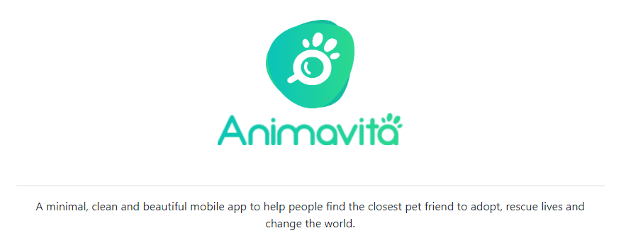

# Projeto com README
um projeto de teste com um arquivo README✨

[](https://google.com)

## Tecnologias utilizadas
- HTML
- CSS3
- JS

## Como utilizar 

1 - Clone o projeto

```
git clone <https://github.com/guifferrari/repositorio-com-readme.git>
```

2 - Acesse a pasta do projeto

```
cd repositorio-com-readme
```